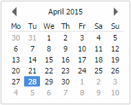
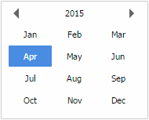
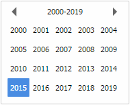
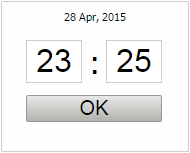

DateTimePicker
==============


DateTimePicker is JavaScript date and time picker that utilises no external Javascript libraries or tool kits. Highly configurable and with keyboard shortcuts, the DateTimePicker works with any date or time format and can either be applied as a date, date/time or time picker.

   

## Usage
```javascript
var dtp = new DateTimePicker(input-target-selector [, options-object]);
```
Where the input-target-selector is an element class name or id, for example `.datetimepickers` or `#pickerone`. The datetimepicker will be effective for all selected input elements.

## Usage with Ajax
After the DateTimePicker instance has been created, when using ajax to retrieve a new date, there are two methods that can be used to update the instance and correctly formatted the retrieved date.
When loading or updating the date via the input elements `value` attribute, by simply calling the `refresh()` method, the DateTimePicker will re-bind to its targets and correctly format the new date value.
```javascript
dtp.refresh();
```

When it is required to loading or updating the date via JavaScript, by calling the `setDate()` method and passing either a JavaScript `Date object` or a date string in the format of the `inputOutputFormat`, the DateTimePicker will re-bind to its targets and correctly format the new date value.

To reset the DateTimePicker instance by calling the `setDate()` method and not passing any value the picker will either clear the current date or will set it to today depending on if the `allowEmpty` is set the `true` or `false`.
```javascript
dtp.setDate();

dtp.setDate([new-date])
```


## Options

| Option | Default value | Description | Options |
| :----- | :------------ | :---------- | :------ |
| `pickerClass` | `datetimepicker` | CSS class for the main datetimepicker container element. | `datetimepicker`, `datetimepicker-yellow`, `datetimepicker-green`, `datetimepicker-blue`, `datetimepicker-red` |
|`toggleElements`|`null`|Toggle your datetimepicker by clicking another element. Specified as a id or class selector, the resulting elements are mapped to the selected datetimepickers by index (the 1st toggle works for the 1st input, the 2nd toggle works for the 2nd input, etc.). |n/a|
|`toggleElementsOnly`|`true`|The picker will only fire from using the Toggle. Setting to `false` will also open the picker when the input field has focus|`true, false`|
|`days`|`[` `'Sunday'`, `'Monday'`, `'Tuesday'`, `'Wednesday'`, `'Thursday'`, `'Friday'`, `'Saturday'` `]`|Labels for the days, allows for localisation|n/a|
|`dayShort`|`2`|Length of day-abbreviations used in the datetimepicker.|n/a|
|`daySuffix`|`["th", "st", "nd", "rd"]`|Suffix labels for the day of the month, allows for localisation. If localisation requires altering this option, note the current position of each existing suffix value within the array.|n/a|
|`months`|`[` `'January'`, `'February'`, `'March'`, `'April'`, `'May'`, `'June'`, `'July'`, `'August'`, `'September'`, `'October'`, `'November'`, `'December'` `]`|Labels for the months, allows for localisation|n/a|
|`monthShort`|`3`|Length of month-abbreviations used in the datetimepicker.||
|`startDay`|`1`|First day of a week. Can be `0` (Sunday) through `6` (Saturday). Default value `1` is Monday.|`0 - 6`|
|`startDate`|`null`|The date the picker is to start at. Supply as a JavaScript `Date` object or as a date string in the format of the `inputOutputFormat`. |Refer to the 'Input/Output value and format' example|
|`timePicker`|`false`|Enable/disable timepicker functionality. Hours/Minutes values can be changed using the scrollwheel or arrow keys and confirmed by clicking Ok or pressing enter. |`true`, `false`|
|`timePickerOnly`|`false`|Set to `true` to use datetimepicker for time-selection only by automatically forcing the `timePicker` and `tartView` options into timepicker mode. Set the format accordingly to display either 12 (`h:i a`) or 24 (`H:i`) hour.|`true`, `false`|
|`timePickerFormat`|`24`|The time format the picker will display the selectors.|`12`, `24`|
|`minuteIncrement`|`1`|The value in which the minute portion of the timepicker will increase or decrease when selecting. On opening of the timepicker if no value is set the time defaults to the current time. If the `minuteIncrement` is set to any thing other than `1` the minute portion will round to the nearest instance matching the set increment. For example if the current time is `12:23pm` and the `minuteIncrement` is set to `5` then the time will be rounded to `12:25pm`, if set to `30` then the time will be rounded to `12:30pm` or if set to `10` then the time will be rounded to `12:20pm`. If the value is set to `0` or the value is greater than `59` the minute portion of the timepicker will be disabled.|`0 - 59`|
|`yearPicker`|`true`|Enable/disable yearpicker functionality. Makes it much easier to change years.|`true`, `false`|
|`format`|`d/m/Y`|Visible date format. Does not affect the actual return value of the picker unless a `null` value is supplied to the `inputOutputFormat`. Refer to `inputOutputFormat` option below.|Refer to the 'Dateformatting' section|
|`inputOutputFormat`|`T`|Define how the return value from the datetimepicker is interpreted after selecting a date. The default is timestamp based on milliseconds since 01/01/1970. If `null` is supplied then the value of the `format` option will be used. Supported format symbols are described in the **Dateformatting** section. If you encounter problems with your formatting, open the browser development tools, as date-parsing errors are reported to the console.|Refer to the 'Dateformatting' section|
|`startView`|`month`|Initial view of the datetimepicker. (The `time` view is only when `timePicker` option is `true`)|`time`, `month`, `year`, `decades`|
|`allowEmpty`|`false`|When set to `true` the datetimepicker intializes empty when no value was set (instead of starting at today). In addition the backspace and delete key will remove a value from the input. |`true`, `false`|
|`positionOffset`|`{ x: 0, y: 0 }`|Allows you to tweak the position at which the datetimepicker appears, relative to the input element. Formatted as an object with `x` and `y` properties. Values can be negative.||
|`minDate`|`null`|Minimum date allowed to pick. Blocks anything before. Formatted as an object with a `date` and `format` property, which allows specification in any format. `{date:'[date-string]',format:'[date-string-interpretation-format]'}` ||
|`maxDate`|`null`|Maximum date allowed to pick. Blocks anything after. Formatted as an object with a `date` and `format` property, which allows specification in any format. `{date:'[date-string]',format:'[date-string-interpretation-format]'}`||
|`debug`|`false`|When enabled, calls made to the three event hooks, `onShow`, `onClose` and `onSelect` are reported to the browser development console.|`true`, `false`|
|`beforeShow`|`function(){}`|Event hook triggered before the datetimepicker pops up.|n/a|
|`onClose`|`function(){}`|Event hook triggered after the datetimepicker is closed (destroyed).|n/a|
|`onSelect`|`function(){}`|Event hook triggered when a date is selected.(comes with 1 argument, the selected date returned in the `inputOutputFormat` format)|n/a|
|`onChange`|`function(){}`|Event hook triggered when a date is selected and differs from the current date(comes with 1 argument, the new date returned in the `inputOutputFormat` format)|n/a|

## Methods

| Method  | Parameters | Description | Return Type |
| :------ | :----------| :---------- | :---------- |
|`refresh`||Refreshes the DateTimePicker instance by re-binding to its target and correctly formating the input elements `value` attribute.||
|`setDate`|`String date` / `Date date`|Updates the DateTimePicker instance current date and correctly formats the given date value, which must be supplied as either a JavaScript `Date object` or as a date string in the format of the `inputOutputFormat`. To reset the DateTimePicker instance by calling the `setDate()` method and not passing any value the picker will either clear the current date or will set it to today depending on if the `allowEmpty` is set the `true` or `false`.||
|`getDate`|`String format (optional)`|Returns the current date for each of the DateTimePicker instance's targets in the form of either a single JavaScript date object, a single formatted date string, an array of date objects or an array of formatted date strings. For each target without a value `null` is returned. If a format string is passed, the `getDate` method will supply a string representation of the date or dates. If no parameter is passed the method will supply JavaScript date objects. If the DateTimePicker instance is configured to be the time picker only then the date portion of the date will be set as 1st January of the current year.|`Date Object`/ `Array of Date Objects`/ `String`/ `Array of Strings`|
|`format`|`Date date`, `String format`|Returns a string representation of the given date object depending on the supplied format string. Supported format symbols are described in the Dateformatting section.|`String`|
|`unformat`|`String date`,` String format`|Returns a date object representation of the given formatted date string. The format string parameter must equal the format that the date string is supplied. Supported format symbols are described in the Dateformatting section.|`Date Object`|

## Keyboard Shortcuts

| Key | Action |
| :-- | :----- |
|`Tab`| Closes the Date Time Picker without selecting a date or time.|
|`Escape`|Closes the Date Time Picker without selecting a date or time.|
|`Enter`|Selects the current chosen year, month, date or time. In the date or time view the picker will return the select date and / or time.|
|`Space Bar`|Changes the view between date, month or year.|
|`Home`|Navigates to the current day, month or year depending on which view is selected.|
|`Left Arrow`|Navigates between days, months, years, hour or minutes depending on which view is selected.|
|`Right Arrow`|Navigates between days, months, years, hour or minutes depending on which view is selected.|
|`Up Arrow`|Navigates between days, months or years depending on which view is selected. If the time picker is visible will increase the hours or minutes depending of which has focus.|
|`Down Arrow`|Navigates between days, months or years depending on which view is selected. If the time picker is visible will decrease the hours or minutes depending of which has focus.|

## Date-formatting

The date-formatting functions featured in the DateTimePicker support the symbols listed below. Unsupported symbols will just be output as provided. To use the supported symbols literally, escape them with `\\`.

| Character | Description | Return Value |
| :-------- | :---------- | :------------|
|`y`|Two digit representation of a year|`Eg. 09, 12`|
|`Y`|Four digit representation of a year|`Eg. 2009, 2012`|
|`m`|Numeric representation of a month, with leading zeros|`01-12`|
|`n`|Numeric representation of a month, without leading zeros|`1-12`|
|`M`|A short textual representation of a month, three letters|`Jan - Dec`|
|`F`|A full textual representation of a month, such as January or March|`January - December`|
|`d`|Day of the month, 2 digits with leading zeros|`01-31`|
|`j`|Day of the month without leading zeros|`1-31`|
|`D`|A textual representation of a day, three letters|`Mon - Sun`|
|`l`|A full textual representation of the day of the week (lowercase 'L')|`Sunday - Saturday`|
|`G`|24-hour format of an hour without leading zeros|`0-23`|
|`H`|24-hour format of an hour with leading zeros|`00-23`|
|`g`|12-hour format of an hour without leading zeros|`1-12`|
|`h`|12-hour format of an hour with leading zeros|`01-12`|
|`a`|Lowercase Ante meridiem and Post meridiem|`am, pm`|
|`A`|Uppercase Ante meridiem and Post meridiem|`AM, PM`|
|`i`|Minutes with leading zeros|`00-59`|
|`s`|Seconds, with leading zeros|`00-59`|
|`U`|Seconds since the Unix Epoch (January 1 1970 00:00:00 GMT|`Eg. 2073614`|
|`T`|Milliseconds since January 1 1970 00:00:00 GMT (Easily used to create a `JavaScript Date object` for example `new Date(1337574801020)`)|`Eg. 1337574801020`|
|`S`|The suffix for the day of the month (as in 1st, 2nd, 23rd or 25th)|`st, nd, rd, th`|

---

Examples
========
Further user documentation and detailed examples can be found [here](http://www.google.com)
